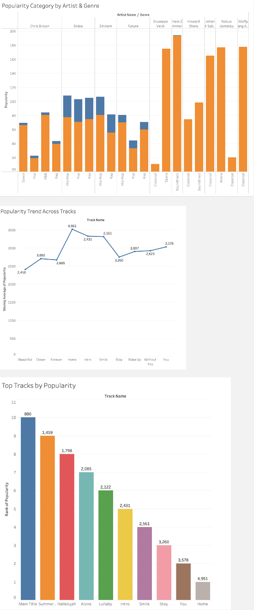
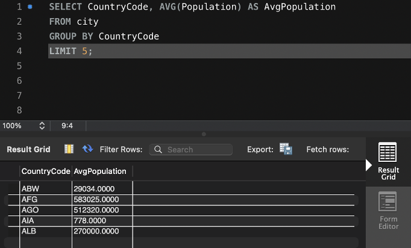
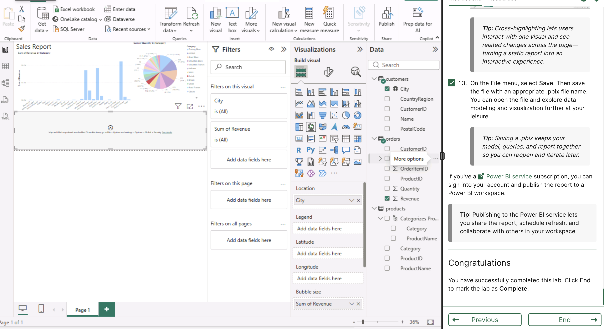
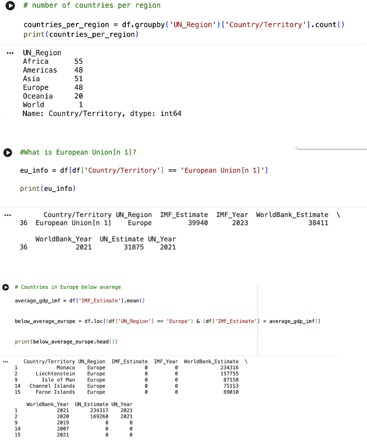

# Data Analytics Bootcamp Portfolio

## Overview
This repository brings together the work I completed during a Data Analytics bootcamp, highlighting both my learning and hands-on experience. It provides an overview of the key topics covered and showcases selected examples of the practical work completed during the course.

Over the course of the bootcamp, I worked with Excel, SQL, Tableau, Power BI, Python, and Microsoft Azure on practical exercises, building strong analytical thinking, technical skills, and confidence working with data.

## About Me & Key Highlights
Throughout the bootcamp, I developed a solid foundation in analysing, visualising, and interpreting data to support informed decision-making. I particularly enjoyed applying my learning to practical tasks and seeing how data analysis can be used in real-world scenarios.

**Key skills and strengths developed include:**
- Applying analytical techniques to explore, clean, and interpret data across multiple tools and platforms
- Effectively presenting insights through dashboards and visualisations
- Demonstrating competence with Excel, SQL, Tableau, Power BI, and Python

---

## Bootcamp Overview

### [Week 01 – Introduction to Data & Excel](Week-01-Data-and-Excel/)
Built a foundation in data analytics concepts and developed practical Excel skills for data preparation, analysis, and visualisation.

---

### [Week 02 – Data Visualisation (Tableau & Power BI)](Week-02-Data-Visualisation/)
Focused on visualising and communicating insights using Tableau and Power BI through interactive dashboards and reports.

---

### [Week 03 – Databases & SQL](Week-03-SQL-and-Databases/)
Explored database fundamentals and used SQL to query, manipulate, and analyse data.

---

### [Week 05 – Cloud Computing & Azure Fundamentals](Week-05-Cloud-and-Azure/)
Introduced cloud computing concepts and Microsoft Azure, focusing on data storage, analytics services, and cloud-based data solutions.

---

### [Week 06 – Python for Data Analysis](Week-06-Python-for-Data-Analysis/)
Applied Python to data analysis tasks, working with DataFrames and creating visualisations.

