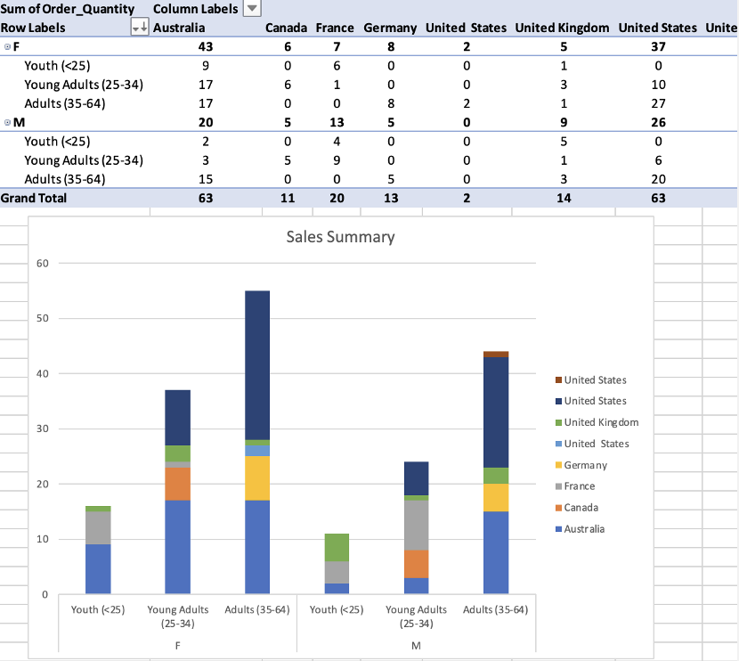

# Data Analytics Bootcamp Portfolio

## Overview
This repository showcases my learning and practical work completed during a Data Analytics bootcamp. It demonstrates hands-on experience across the full data analytics workflow, including data cleaning, analysis, visualisation, and reporting using industry-standard tools.

Throughout the bootcamp, I developed practical experience using Excel, SQL, Tableau, Power BI, Python, and Microsoft Azure while working with real-world datasets and business scenarios to strengthen analytical thinking, technical skills, and data-driven storytelling.

## About Me & Key Highlights
Throughout this Data Analytics bootcamp, I developed a strong foundation in analysing, visualising, and interpreting data to support informed decision-making. I particularly enjoyed working with real-world datasets and transforming raw data into clear insights using a combination of analytical thinking and practical tools.

**Key skills and strengths developed include:**
- Applying analytical techniques to explore, clean, and interpret data across multiple tools and platforms
- Communicating insights clearly through dashboards and visualisations
- Working confidently with Excel, SQL, Tableau, Power BI and Python

This repository reflects both my technical development and my approach to learning — combining hands-on practice, problem-solving, and continuous learning.

---

## Bootcamp Overview

### [Week 01 – Introduction to Data & Excel](Week-01-Data-and-Excel/)
Built a foundation in data analytics concepts and developed practical Excel skills for data preparation, analysis, and visualisation.

---

### [Week 02 – Data Visualisation (Tableau & Power BI)](Week-02-Data-Visualisation/)
Focused on visualising and communicating insights using Tableau and Power BI through interactive dashboards and reports.

---

### [Week 03 – Databases & SQL](Week-03-Databases-SQL/)
Explored database fundamentals and used SQL to query, manipulate, and analyse data.

---

### [Week 05 – Cloud Computing & Azure Fundamentals](Week-05-Cloud-Azure/)
Introduced cloud computing concepts and Microsoft Azure, focusing on data storage, analytics services, and cloud-based data solutions.

---

### [Week 06 – Python for Data Analysis](Week-06-Python-Data-Analysis/)
Applied Python to data analysis tasks, working with dataframes, performing transformations, and creating visualisations.

---

For detailed learning outcomes, technical explanations, and additional examples, please explore the README files within each individual week folder.

## Bootcamp Breakdown
- [Week 01 – Introduction to Data & Excel](Week-01-Data-Excel/)
- [Week 02 – Data Visualisation (Tableau & Power BI)](Week-02-Data-Visualisation/)
- [Week 03 – Databases & SQL](Week-03-Databases-SQL/)
- [Week 05 – Cloud Computing & Azure Fundamentals](Week-05-Cloud-Azure/)
- [Week 06 – Python for Data Analysis](Week-06-Python-Data-Analysis/)
