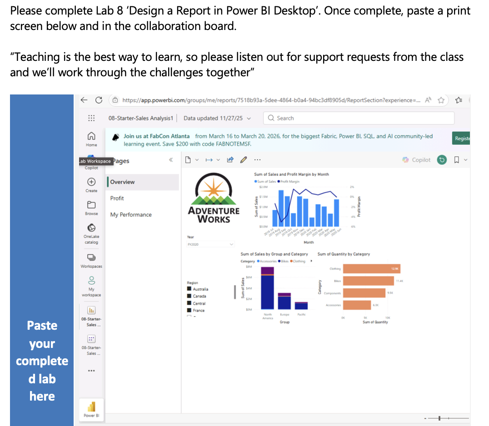

# Week 02 – Data Visualisation with Tableau and Power BI

## Overview
In Week 2, I explored data visualisation tools, focusing on Tableau and Power BI. The goal was to learn how to prepare, visualise, and analyse data using interactive dashboards, while gaining an understanding of the basic features and functions of both tools.

---

## Key Learnings

### Tableau
- Introduction to Tableau and its value in data-driven decision-making
- Importing and connecting to datasets 
- Setting up relationships between data tables
- Data preparation: sorting, removing nulls, tidying, and transforming data for analysis
- Creating interactive dashboards and maps
- Using calculated fields and basic forecasting

### Power BI
- Understanding Power BI as a business intelligence tool
- Importing and cleaning datasets using Power Query
- Creating data models and establishing relationships between tables
- Developing interactive reports and dashboards with slicers and filters
- Applying DAX (Data Analysis Expressions) for calculated columns and measures
- Identifying similarities and differences between Tableau and Power BI workflows

---

## Skills & Knowledge Developed
- Creating visualisations to communicate insights
- Preparing and cleaning data for analysis
- Building dashboards in Tableau and Power BI
- Applying basic calculations and forecasting
- Understanding foundational BI concepts like data relationships and calculated metrics
- Comparing two visualisation platforms to understand their strengths

---

## Sample Work
Here is my work in Tableau and Power BI, including a Tableau dashboard showing percentage change and key impacted city locations from a job change dataset, and a Power BI visualisation of sales and profit by month, category, and product group.

