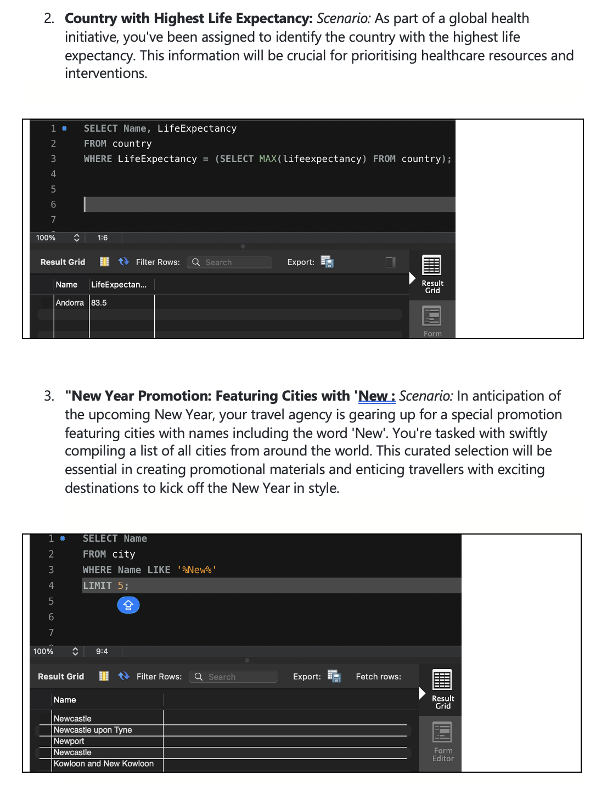

# Week 03 – Databases and SQL

## Overview
In Week 3, I focused on databases and SQL, learning how data is stored, organised, and retrieved using relational and non-relational databases, while gaining hands-on experience using SQL for data analytics.

---

## Key Learnings

### Database Fundamentals
- Understanding what a database system is and why we use databases
- Differences between relational and non-relational databases
- Key database terminology and their importance
- Database design concepts:
  - Entities and entity descriptions
  - Entity identifiers (primary keys, composite primary keys)
  - Secondary keys
  - Relationships between entities and relationship diagrams
  - Database structure and creating relationships
  - Foreign keys and referential integrity
  - Linking tables
- Database Management Systems (DBMS) and Relational DBMS (RDBMS)
- Database schemas and schema types

### SQL for Data Analytics
- Understanding SQL 
- Data manipulation and filtering
- Sorting, modifying, adding, and removing data
- Performing calculations in queries
- Working with subqueries and grouping data
- Handling null values
- Joining tables across datasets
- Applying SQL to support data analytics tasks in relational databases

---

## Skills & Knowledge Developed
- Understanding the structure and purpose of databases
- Designing simple relational database schemas
- Writing SQL queries to extract, filter, and analyse data
- Joining tables and managing relationships for accurate analytics
- Using SQL to perform calculations and clean datasets for analysis

---

## Sample Work
Here is my work in SQL, showing queries used to find the highest life expectancy and compile a list of all cities worldwide from a provided dataset.

