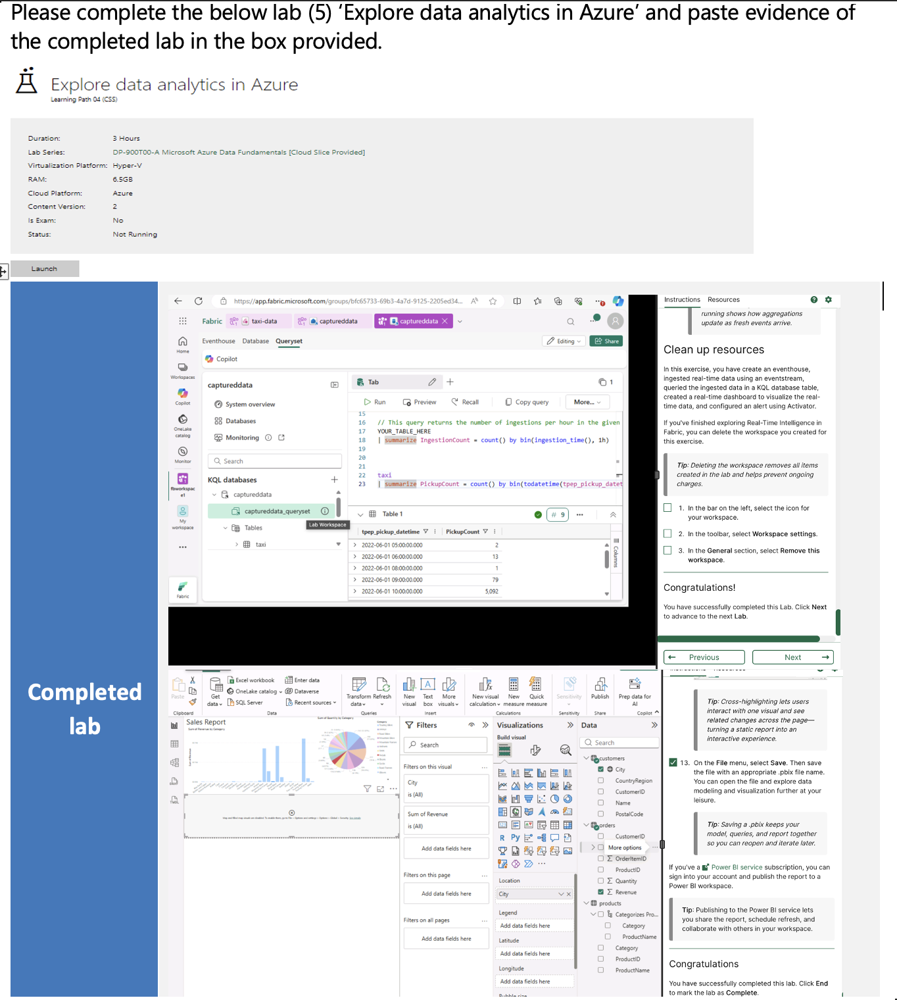

# Week 05 – Cloud Computing & Azure Fundamentals

## Overview
In Week 5, I explored cloud computing concepts and Microsoft Azure as part of my data analytics bootcamp. The focus was on understanding cloud deployment models, security and legislation, and the capabilities of Azure services for data storage and analytics. I also applied this knowledge through hands-on practice assessments and a business proposal activity..

---

## Key Learnings

### Cloud Computing Fundamentals
- Definition and key characteristics of cloud computing
- Understanding cloud deployment models:
  - IaaS (Infrastructure as a Service)
  - PaaS (Platform as a Service)
  - SaaS (Software as a Service)
- Key components of cloud security
- Major cloud providers: AWS, Azure, GCP
- Role of legislation in protecting users and their data, including amendments and updates

### Microsoft Azure
- Overview of Azure services and data storage options
- Azure storage solutions:
  - Azure Blob Storage
  - Azure Data Lake Gen2
  - Azure Files Storage
  - Azure Table Storage
- Azure Cosmos DB: key features and capabilities
- Large-scale analytical solutions and real-time analytics features

### Applied Activities
- Completing Azure practice assessments
- Presenting and “selling” Azure services to a client

### Business Proposal Activity (Summary)
- Identified relevant data laws and regulations for handling customer data  
- Recommended Azure services tailored to the company’s data analysis needs and explained their suitability  
- Defined the types of data the business will work with and outlined a data modelling approach  
- Planned data storage in Azure, including formats and best practices  
- Considered additional aspects to enhance efficiency: backup and disaster recovery, data visualisation, and future scalability

---

## Skills & Knowledge Developed
- Understanding cloud computing and deployment models
- Comparing major cloud providers and their offerings
- Completed DP-900 (Microsoft Azure Data Fundamentals) labs, gaining hands-on experience with relational data, non-relational data, and analytical data solutions in Azure
- Working with Azure data storage and analytics services
- Applying cloud concepts to practical tasks, including assessments and client proposals
- Communicating technical solutions in a business context

---

## Sample Work
Here is my completed lab work exploring data analytics in Azure, including querying real-time data with KQL, working with Azure data storage, and creating interactive visualisations in Power BI.

