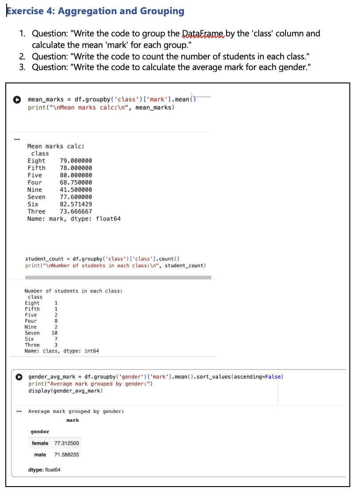

# Week 06 – Python for Data Analysis

## Overview
In Week 6, I focused on Python programming for data analysis, learning how to implement code efficiently and apply it to real-world data analysis tasks using libraries such as Pandas.

---

## Key Learnings

### Python Fundamentals
- Purpose and advantages of using Python for data analysis
- Understanding algorithms and their impact on program performance
- Key concepts: data types, functions and arguments, object-oriented programming (OOP)
- Conditional statements (`if`) and control flow based on varying conditions
- Implementing loops to iterate over data collections efficiently

### Data Analysis with Python
- Introduction to common Python libraries for data analysis
- Understanding DataFrames and their role in managing structured data
- Using Pandas to manipulate, analyse, and visualise datasets
- Creating visualisations directly from DataFrames to summarise and communicate insights

---

## Skills & Knowledge Developed
- Writing and executing Python code for data manipulation and analysis
- Applying control structures and loops to automate tasks
- Creating and using functions for modular and reusable code
- Performing data cleaning, transformation, exploration, and visualisation using Pandas
- Understanding and implementing algorithms to solve problems efficiently

---

## Sample Work
Here is my work in Python, demonstrating data analysis techniques including aggregation and grouping on a sample dataset.

